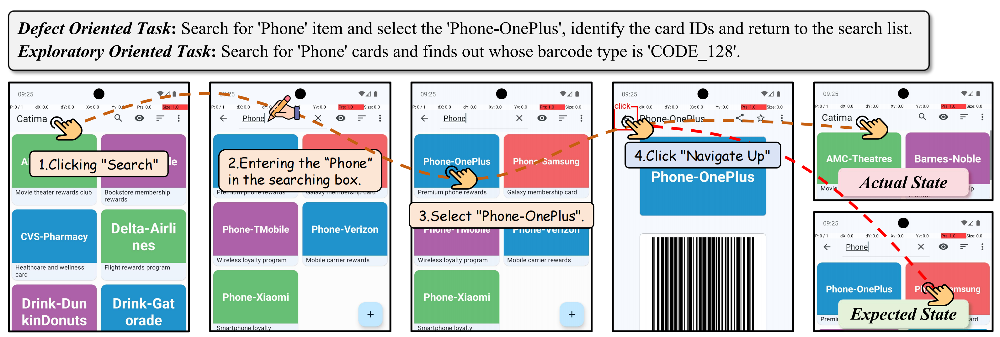
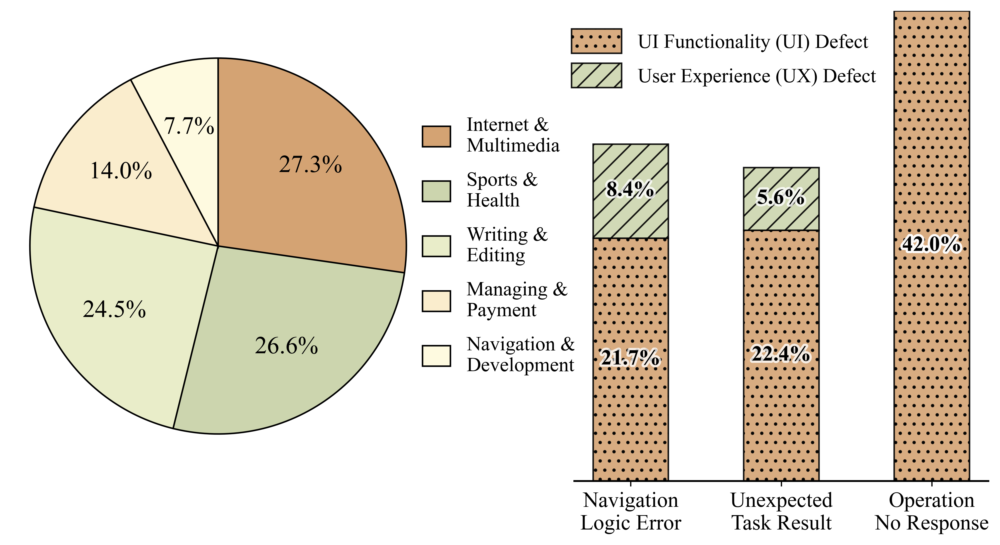

# GUITestBench: Enabling GUI Agents for Exploratory Defect Discovery

<div align="center">
Yifei Gao<sup>1</sup>, Jiang Wu<sup>2</sup>, Xiaoyi Chen<sup>1</sup>, Yifan Yang<sup>1</sup>, Zhe Cui<sup>2</sup>, Tianyi Ma<sup>2</sup>, Jiaming Zhang<sup>3</sup>, Jitao Sang<sup>1*</sup>
</div>
<div align="center">
<sup>1</sup>Beijing Jiaotong University&emsp;<sup>2</sup>Hithink RoyalFlush Inc.&emsp;<sup>3</sup>Nanyang Technological University
</div>
<div align="center">
* Corresponding Author
</div>



GUITestBench enables agents interacting with mobile apps to discover defects through multi-step operations in Android emulators. GUI defects are collected from public issues on GitHub, including UI functional defects and user experience (UX) defects, and further categorized into three defective modes: **Operation No Response** (ONR), **Unexpected Task Results** (UTR) and **Navigation Logic Error** (NLE).

## News
* [26/12/2025] 📢 We release the code of GUITestBench.

## 📊 Dataset Statistics



## ⚖️ Evaluation Methods

* **Rule-based Evaluation**: We verify two conditions: (1) State matching: whether the agent successfully navigates to the screen where the defect resides; (2) Action matching: whether the agent executes the exact defect-triggering action.
* **Judge Model Evaluation**: We provide the LLM judge with detailed defect specifications, including preconditions, expected results, and screenshots before and after the triggering action. Given the agent's execution trajectory, the judge determines whether the defect has been successfully triggered.

## Evaluation Metrics
We quantify the agent's performance using **Recall** and **F1 Score**


## 💻 Usage & Quick Start
Follow these steps to set up the environment and run the evaluation pipeline on GUITestBench.

### 1. Download Android Emulator

* Step1: click `More Actions`
* Step2: click `Virtual Device Manager`
* Step3: click `+`
* Step4: select the device (must be Pixel 6) and click `Next`
* Step5: rename with `AndroidEnv`
* Step6: select API with `API 33 "Tiramisu"; Android 13.0`
* Step7: select `System Image` with `Google APIs ARM 64 v8a System Image`
* Step8: click `Finish`

### 2. Setup Android Emulator

* Step1: Get your adb & emulator path
* Step2: Set the path in `configs/android_env.yaml`, `scripts/setup.sh` and `scripts/close.sh`
* Step3: Initialize the Android environment and start the emulator with specified ports:
```bash
bash ./scripts/setup.sh GUITestBench 5556 8558
```

### 3. Run Evaluation on GUITestBench
```bash
# Run evaluation for all 143 tasks
python eval.py --llm=uitars --test_start_idx=0 --test_end_idx=143
```

## ✍️ TODO
* Adding more GUI Agents evaluation on GUITestBench.
* Adding evaluation parts.